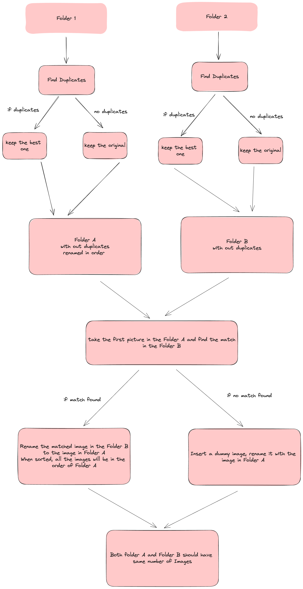

# Getting started on Windows

The way you set things up on Linux and Windows is slightly different. Windows make life hard for devs.

First, install Chocolatey. This acts like homebrew for Mac. Open command prompt as admin.

```bash
@"%SystemRoot%\System32\WindowsPowerShell\v1.0\powershell.exe" -NoProfile -InputFormat None -ExecutionPolicy Bypass -Command "[System.Net.ServicePointManager]::SecurityProtocol = 3072; iex ((New-Object System.Net.WebClient).DownloadString('https://community.chocolatey.org/install.ps1'))" && SET "PATH=%PATH%;%ALLUSERSPROFILE%\chocolatey\bin"
```

You may have to run:

```bash
nano ~/.bash_profile
export PATH=$PATH:/c/ProgramData/chocolatey/bin
```

If you don't have it already, you also need the [C++ build tools](https://visualstudio.microsoft.com/visual-cpp-build-tools/) for some libraries, as well as [Cmake](https://cmake.org/download/).


Now we need to confirm that our code works first. You can run the application in debug mode directly via:

```bash
# look into config.ini 
make setup
source env/Scripts/activate
python launch.py
```

## For Mac

Assuming you have brew and conda installed, everything should be easy.

```bash
brew install cmake
brew install pkg-config
brew install cairo
make setup
source env/bin/activate
python launch.py
```

# Packaging to executables

This is the most tricky part, but I have managed to package the application using two tools:

1. Nuitka
2. Inno Setup (For windows)

The code, dependencies, and assets all need to be converted into executables first. Assert it runs the same as debug mode.

```bash
chmod +x helpers/package.sh
make nuitka
```

## Distributing to Windows Users (Windows Installer file)

Now collected execution files need to be wrapped up for Windows users, so that they can download with an installer.

To distribute the `.exe` file to Windows Users in a standard way, you need [INNO setup tools](https://jrsoftware.org/isdl.php). Just download the installer and feed in your files based on Wizard prompt to generate `.iss` Pascal script that can be auto-compiled into a Windows installer by Inno setup tools. You do not have to code anything, just make sure you pass my `windows.iss` to Inno setup, and it will compile the installer for you. You can pass the output to the client. Getting code signing is very troublesome, and requires payment. Not worth it for this purpose.

```bash
make windows
```

# V1 todo list (Prototype)

- ✅ Complete the front-end using Pyside6. Use threads to unblock GUI and send signals b/w layers.
- ✅ Complete multiprocessor face detection to be used by face search feature and face clustering
- ✅ Complete post-processing logic. Only use the top three biggest face for multi-face scenarios.  
- ✅ Replace `faiss` that was difficult to build with `nmslib-metabrainz` (Half complete. This should be built natively).
- ✅ Implement function to read images safely using metadata for rotated face scenarios
- ✅ Create a feature to download heavy weights efficienly from google drive.
- ✅ Test building the package using Nuitka and Inno setup for deployment on Windows. 
- ✅ Create `DP2 match` feature. Drop `yolo-world`, since the result is subpar. Use `yolo11-seg`, use heuristics to capture most likely targets in the center. Get extracted mask of the candidate using semgentation masks.  
- ❌ Add face-reidentification based on masks and apply culling feature to DP2 match. Complete the dp2 feature. 
- ❌ Use openvino for faster inference. Think about batch export instead of multiprocessing.



**How would embeddings work?**
A. Run yolo seg algorithm and heuristics finder to find masks of candidates across stack A and B. Convert every masks into embeddings by cropping image regions with polgon mask. 
B. For each embedding, cluster them using HDBSCAN, while maintaining the source metadata (where it came from). Ignore the ones that have too many matches, because it is very like that it is a professor or other people who repetively appear on frames. 
C. For each cluster (ensure each embeddings are indeed from different, yet consecutive images, of a same person), run culling algorithm (bad exposure, eyes closed, etc) to remove bad images and duplicates.
D. Make sure that stack A and B have same number of images this way. If the number of images do not match, do not remove images even if image is bad in terms of culling. If there is not enough image, create blank dummy image.     


# V2 todo list

- ❌ Pyside can only handle rudimentary design. Work on Javascript front-end together. 
- ❌ Put all the machine learning models inside a backend server and respond to requests from front-end. Use things like MLServer, Kserve, Bentoml. Triton server is overkill because we won't be using GPU models. 
- ❌ Work on general culling feature this should be easy because Dp2 feature would already have the basic culling feature
- ❌ Work on image retrieval feature. If user throws some query, "Find me a photo of a person standing in front of beatch", use a caption model to convert images into captions, and calculate linguistic similarities. 
- ❌ Build for both windows and mac. 


## TODO: 

Perhaps save the instance box score, so if you are unable to make decisions, use that instead.